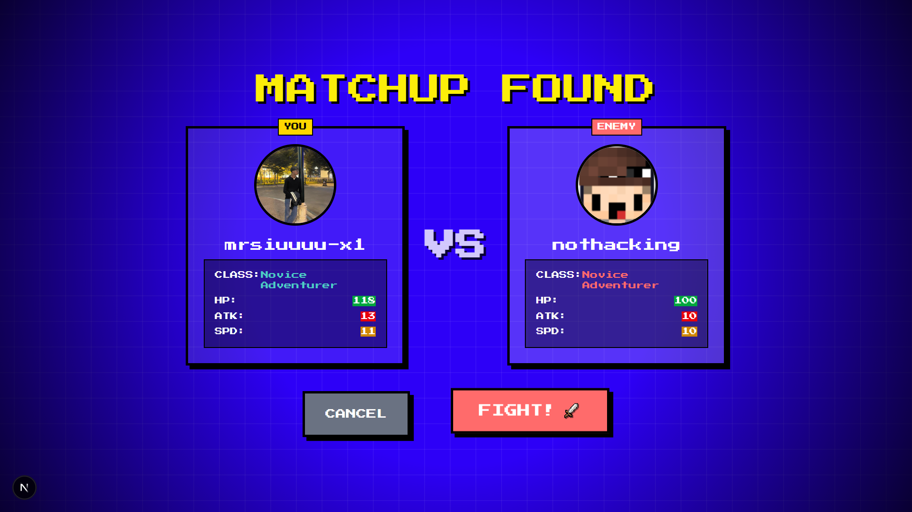

# Git Battle

**A turn-based RPG where your GitHub stats determine your power.**

Git Battle takes two GitHub usernames, analyzes their profiles (Repositories, Followers, Activity), and generates a unique RPG character class and stats. Battle your friends or famous developers in a retro 8-bit arena!

 
## Features

* **Real-Time Data:** Fetches live data from the GitHub API.
* **Class System:** Your coding habits determine your RPG Class:
    * **Frontend Warrior:** High Speed. Special: *Pixel Slash* (Double Hit).
    * **Backend Mage:** High Attack. Special: *DDoS Blast* (Massive Dmg + Recoil).
    * **DevOps Paladin:** High Defense. Special: *Container Shield* (Damage + Heal).
    * **Full Stack Sorcerer:** Balanced Stats.
* **Strategic Combat:**
    * **Speed Mechanic:** Faster characters attack first and crit more often.
    * **Cooldown Management:** Tactical use of Heals and Special Abilities.
    * **Smart AI:** Opponent AI reacts to low health and cooldowns.
* **Retro Aesthetic:** Custom pixel fonts, CSS animations, and 8-bit UI design.

## How It Works

The game engine calculates stats based on your GitHub profile:
* **HP:** Base + Repos + Followers
* **Attack:** Scaled by Repository count.
* **Defense:** Scaled by Follower count.
* **Speed:** Scaled by Repository count (Frontend Warriors get a speed buff).
* **Variance:** A slight random multiplier ensures no two battles are exactly the same.

## Tech Stack

* **Framework:** [Next.js 15](https://nextjs.org/) (App Router)
* **Language:** [TypeScript](https://www.typescriptlang.org/)
* **Styling:** [Tailwind CSS v4](https://tailwindcss.com/)
* **API:** GitHub REST API
* **Icons:** Lucide React (Pixelated via CSS)

## Getting Started

To run locally, follow these steps:

1.  **Clone the repository:**
    ```bash
    git clone [https://github.com/yourusername/git-battle.git](https://github.com/yourusername/git-battle.git)
    cd git-battle
    ```

2.  **Install dependencies:**
    ```bash
    npm install
    # or
    yarn install
    ```

3.  **Run the development server:**
    ```bash
    npm run dev
    ```

4.  **Open your browser:**
    Navigate to [http://localhost:3000](http://localhost:3000)

## Roadmap (Coming Soon)

* [ ] 💥 Floating Damage Numbers
* [ ] 🔊 Retro Sound Effects (8-bit sfx)
* [ ] 🏆 Win Streaks & High Scores
* [ ] 🌐 Multiplayer Mode (WebSockets)

## Contributing

Pull requests are welcome! For major changes, please open an issue first to discuss what you would like to change.