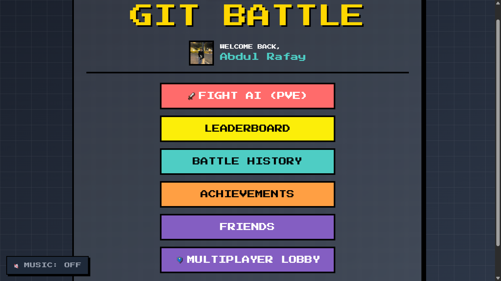

# Git Battle

**A turn-based RPG where your GitHub stats determine your power.**

Git Battle takes two GitHub usernames, analyzes their profiles (Repositories, Followers, Activity), and generates a unique RPG character class and stats. Battle your friends or famous developers in a retro 8-bit arena!



## Features

### Combat System
* **6 Character Classes** — Your coding habits determine your RPG class:
    * **Frontend Warrior:** High Speed. Special: *Pixel Slash* (Double Hit).
    * **Backend Mage:** High Attack. Special: *DDoS Blast* (Massive Dmg + Recoil).
    * **DevOps Paladin:** High Defense. Special: *Container Shield* (Damage + Heal).
    * **Full-Stack Samurai:** Balanced stats. Special: *Code Fusion* (Damage + Mana Restore).
    * **Open-Source Wizard:** All-around excellent. Special: *Community Strike* (Star-scaled Damage).
    * **Code Apprentice:** Starter class. Special: *Hello World Smash*.
* **Strategic Combat:**
    * Speed-based turn order with critical hit scaling.
    * Mana system gating Special (25 mana) and Heal (15 mana) abilities.
    * Cooldown management for tactical ability usage.
* **PvE Mode** — Fight AI opponents at Easy, Medium, or Hard difficulty.
* **PvP Multiplayer** — Real-time battles via Pusher with room codes (public or private).

### Progression & Social
* **Tier System** — Rank up from Background NPC to Final Boss based on wins, with rank-up animations.
* **8+ Achievements** — Unlock achievements for battle milestones, GitHub stats, and language specialist badges (18 languages).
* **Leaderboard** — Filterable leaderboard with sort by wins/win rate/total battles, tier filter, and top 10/25/50.
* **Battle History** — Track your last 20 battles, win/loss record, and current streak.
* **Friend System** — Search users, send/accept/decline friend requests, and view friends list with tier badges and W/L stats.
* **Online Presence** — See which friends are online (green dot) or offline (greyed out) in real-time.
* **Friend Challenges** — Challenge online friends to battle with a single click; they receive a real-time popup invitation.

### Technical
* **GitHub Stats Caching** — 7-day TTL in PostgreSQL to reduce API calls.
* **GitHub OAuth** — Login with your GitHub account via NextAuth.
* **Retro Aesthetic** — Custom pixel fonts, CSS animations, synthesized 8-bit sound effects, and background music.
* **Mobile Responsive** — Fully responsive design across all screens.

## How It Works

The game engine calculates stats based on your GitHub profile:
* **HP:** Base + Repos + Followers (clamped 200-600)
* **Attack:** Scaled by Repository count (10+)
* **Defense:** Scaled by Follower count (5+)
* **Speed:** Scaled by Repository count with class-based buffs (10+)
* **Mana:** Base pool for ability usage (10+)
* **Crit Rate:** Influenced by activity level

## Tech Stack

* **Framework:** [Next.js 16](https://nextjs.org/) (App Router)
* **Language:** [TypeScript](https://www.typescriptlang.org/)
* **Styling:** [Tailwind CSS v4](https://tailwindcss.com/)
* **Database:** PostgreSQL via [Prisma](https://www.prisma.io/)
* **Real-time:** [Pusher](https://pusher.com/) (WebSockets for multiplayer & presence)
* **Auth:** [NextAuth.js](https://next-auth.js.org/) with GitHub OAuth
* **API:** GitHub REST API (via Axios)

## Getting Started

### Prerequisites
* Node.js 18+
* PostgreSQL database (e.g., [Neon](https://neon.tech/))
* GitHub OAuth App
* Pusher account

### Environment Variables

Create a `.env` file with:
```env
PRISMA_DATABASE_URL=your_postgres_url
POSTGRES_URL=your_postgres_direct_url
GITHUB_ID=your_github_oauth_client_id
GITHUB_SECRET=your_github_oauth_client_secret
NEXTAUTH_SECRET=your_nextauth_secret
PUSHER_APP_ID=your_pusher_app_id
PUSHER_KEY=your_pusher_key
PUSHER_SECRET=your_pusher_secret
PUSHER_CLUSTER=your_pusher_cluster
NEXT_PUBLIC_PUSHER_KEY=your_pusher_key
NEXT_PUBLIC_PUSHER_CLUSTER=your_pusher_cluster
```

### Setup

1.  **Clone the repository:**
    ```bash
    git clone https://github.com/mrsiuuuu-x1/git-battle.git
    cd git-battle
    ```

2.  **Install dependencies:**
    ```bash
    npm install
    ```

3.  **Set up the database:**
    ```bash
    npx prisma migrate dev
    ```

4.  **Run the development server:**
    ```bash
    npm run dev
    ```

5.  **Open your browser:**
    Navigate to [http://localhost:3000](http://localhost:3000)

## Roadmap

- [x] Character generation (6 classes, stats from GitHub)
- [x] Turn-based battle engine with mana system
- [x] PvE (3 difficulties) + PvP multiplayer
- [x] Tier/rank system with rank-up animations
- [x] Achievements, leaderboard, battle history
- [x] GitHub OAuth + stats caching
- [x] Friend system with online presence tracking
- [x] Real-time friend challenges via Pusher
- [x] Social sharing (battle results, profile cards)
- [x] Language specialist badges (18 languages, 5+ repos threshold)
- [x] Enhanced leaderboard filters (sort, tier filter, top N)
- [ ] Quest system
- [ ] Equipment & items
- [ ] Battle arenas
- [ ] Battle replays
- [ ] Tournament mode
- [ ] Team battles
- [ ] Guild system
- [ ] Discord bot integration

## Contributing

Pull requests are welcome! For major changes, please open an issue first to discuss what you would like to change.